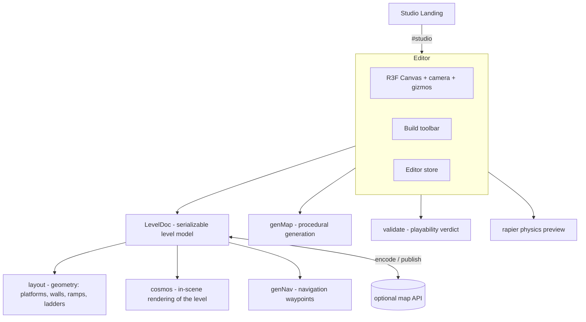

# Space Attack Studio

[](https://github.com/AndrewwPataleta/spaceattack-studio/actions/workflows/ci.yml)

A browser-based **3D level editor** built with React Three Fiber. Design levels in a real-time 3D scene, drop and transform blocks, gates and props, generate levels procedurally, validate them, and preview them with physics, all in the browser.

**▶ Live demo: [studio.spaceattack.app/#studio](https://studio.spaceattack.app/#studio)**


## What it does

- **3D editing** in a live `@react-three/fiber` canvas: orbit camera, `TransformControls` gizmos, snapping, and a build toolbar.
- **Level model** as a serializable document (`LevelDoc`): platforms, walls, ramps, ladders, gates, decor and parallax layers, encoded to a shareable string.
- **Procedural generation** (`genMap`): seedable random maps with tunable options, plus auto-navigation waypoint generation for bots.
- **Physics preview** with `@react-three/rapier`, so you can feel jumps and gaps before shipping a level.
- **Validation** (`validate`): checks a level for reachability and playability and returns a verdict.
- **Templates** and a **design-system lab** for consistent theming, plus **i18n** (multiple languages).

## Architecture



## Project structure

- `src/studio/` - the editor: `StudioApp` (main 3D editor), `BuildBar`, `genMap`, `validate`, `templates`, `store`, `theme`, `i18n`, and sub-labs (`DesignLab`, `KitLab`, `GateLab`, `LearnLab`, `Tutor`).
- `src/game/levels/` - the level model: `levelDoc` (document + encoding), `layout` (geometry), `cosmos` (in-scene rendering), `genNav` (navigation).
- `src/arena/` - shared 3D pieces used to preview a level (gates, city, props, combat helpers).
- `src/StudioLanding.tsx` - the landing page.
- `public/` - 3D models (`.glb`) and textures used by the preview.

## Quick start

```bash
npm install
npm run dev      # http://localhost:5290
```

- The landing page is the default route.
- Open **`#studio`** to launch the 3D editor. Other labs: `#dslab`, `#kit`, `#gatelab`, `#learn`.

```bash
npm run build      # production build
npm run preview    # preview the build
npm run typecheck  # tsc
```

## Tech stack

- React 19 + TypeScript + Vite
- three.js (r172)
- @react-three/fiber, @react-three/drei
- @react-three/rapier (physics)
- @react-three/postprocessing

## License

MIT - see [LICENSE](./LICENSE).
